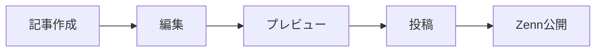

# Zenn-Qiita Sync 完全ガイド

## 📚 このプロジェクトについて

**Zenn-Qiita Sync**は、技術記事をZennとQiitaの両方に同時投稿・管理できるツールです。

### ✨ 2つの使い方

1. **🤖 AI経由（MCPサーバー）** - Claude Desktopに話しかけるだけで記事を管理
2. **⌨️ 手動操作（CLI）** - コマンドラインで直接操作

## 🎯 クイックスタート

### 必要なもの
- ✅ Node.js v18以上
- ✅ Git
- ✅ GitHubアカウント
- ✅ Zennアカウント
- ✅ Qiitaアカウント
- ✅ Claude Desktop（AI経由の場合）

## 📖 目次

1. [事前準備（共通）](#1-事前準備共通)
2. [AI経由での使い方（MCPサーバー）](#2-ai経由での使い方mcpサーバー)
3. [手動での使い方（CLI）](#3-手動での使い方cli)
4. [基本的な操作方法](#4-基本的な操作方法)
5. [トラブルシューティング](#5-トラブルシューティング)
6. [コマンド・用語集](#6-コマンド用語集)

---

## 1. 事前準備（共通）

### Step 1: GitHubリポジトリの作成とZenn連携

#### 1-1. GitHubでリポジトリを作成

1. [GitHub](https://github.com)にログイン
2. 右上の「+」→「New repository」
3. 以下の設定で作成：
   ```
   Repository name: zenn-content
   Description: Zennの記事を管理
   Public: ◉ （必須）
   Initialize with README: ☐ （チェックしない）
   ```
4. 「Create repository」をクリック

#### 1-2. Zennと連携

1. [Zenn](https://zenn.dev)にログイン
2. 右上のアイコン → 「GitHub からのデプロイ」
3. 「リポジトリを連携する」→ `zenn-content`を選択
4. 「連携する」をクリック

#### 1-3. リポジトリをローカルに準備

```bash
# デスクトップに移動
cd ~/Desktop  # Mac
cd %USERPROFILE%\Desktop  # Windows

# リポジトリをクローン
git clone https://github.com/あなたのユーザー名/zenn-content.git
cd zenn-content

# Gitの初期設定（初回のみ）
git config --global user.name "あなたの名前"
git config --global user.email "your-email@example.com"
```

### Step 2: Qiita APIトークンの取得

1. [Qiita](https://qiita.com)にログイン
2. 右上のアイコン → 「設定」
3. 左メニューの「アプリケーション」
4. 「新しいトークンを発行する」
5. 設定：
   ```
   アクセストークンの説明: Zenn-Qiita Sync
   スコープ:
   ☑ read_qiita
   ☑ write_qiita
   ```
6. 「発行する」→ **トークンを必ずコピー保存**（二度と表示されません）

### Step 3: プロジェクトのセットアップ

```bash
# zenn-contentフォルダ内で実行
git clone https://github.com/shin-mcp/zenn-qiita-sync.git
cd zenn-qiita-sync

# 依存関係をインストール
npm install

# 環境変数を設定
echo "QIITA_TOKEN=取得したトークン" > .env

# 初期化
npm run init
```

---

## 2. AI経由での使い方（MCPサーバー）

### Step 1: MCPサーバーのビルド

```bash
# MCPサーバーのセットアップ
cd mcp-server
npm install
npm run build
cd ..
```

### Step 2: Claude Desktopの設定

#### Mac の場合

1. 設定フォルダを作成：
   ```bash
   mkdir -p ~/Library/Application\ Support/Claude
   ```

2. 設定ファイルを作成：
   ```bash
   nano ~/Library/Application\ Support/Claude/claude_desktop_config.json
   ```

3. 以下の内容を入力（パスとトークンを変更）：
   ```json
   {
     "mcpServers": {
       "zenn-qiita-sync": {
         "command": "node",
         "args": ["/Users/あなたのユーザー名/Desktop/zenn-content/zenn-qiita-sync/mcp-server/build/index.js"],
         "env": {
           "QIITA_TOKEN": "取得したQiitaトークン"
         }
       }
     }
   }
   ```

4. 保存して終了：`Ctrl + X` → `Y` → `Enter`

#### Windows の場合

1. `Win + R`で「ファイル名を指定して実行」
2. `%APPDATA%\Claude`と入力
3. `claude_desktop_config.json`を作成
4. 以下の内容を入力（パスとトークンを変更）：
   ```json
   {
     "mcpServers": {
       "zenn-qiita-sync": {
         "command": "node",
         "args": ["C:\\Users\\あなたのユーザー名\\Desktop\\zenn-content\\zenn-qiita-sync\\mcp-server\\build\\index.js"],
         "env": {
           "QIITA_TOKEN": "取得したQiitaトークン"
         }
       }
     }
   }
   ```

### Step 3: Claude Desktopで使う

1. Claude Desktopを再起動
2. 初期化：
   ```
   ZennとQiitaを初期化して
   ```
3. 記事作成：
   ```
   Pythonの基礎について記事を書いて
   ```
4. 投稿：
   ```
   記事を投稿して
   ```
5. Zennに公開：
   ```
   Zennに公開して
   ```

---

## 3. 手動での使い方（CLI）

### 🚀 最速で記事を作成する方法

```bash
# Webインターフェースを起動（一番簡単！）
npm run web

# またはショートカット
./web.sh
```

ブラウザが自動的に開き、フォームで記事を作成できます。

### 📝 コマンドラインでの操作

#### 新規記事作成

```bash
# オプション指定
npm run new -- --title "記事タイトル" --emoji "🚀" --topics "JavaScript,React"

# 対話形式
./create-article.sh

# Webフォーム
npm run new -- --web
```

#### 記事の投稿

```bash
# 特定の記事を投稿
npm run post 記事のslug

# 全記事を同期
npm run sync

# Qiitaから変更を取得
npm run pull
```

#### プレビュー

```bash
# Zennのプレビュー
npm run preview:zenn

# Qiitaのプレビュー
npm run preview:qiita
```

---

## 4. 基本的な操作方法

### 記事のライフサイクル



### 典型的な使用例

#### AI経由（Claude Desktop）
```
あなた：ReactのカスタムHookについて記事を書いて
Claude：記事を作成しました！

あなた：useEffectの例も追加して
Claude：記事を更新しました。

あなた：両方に投稿して
Claude：ZennとQiitaに投稿しました！

あなた：Zennにも公開して
Claude：GitHubにプッシュしました。
```

#### 手動操作（CLI）
```bash
# 1. 記事作成
npm run new -- --title "ReactのカスタムHook入門" --emoji "⚛️" --topics "React,JavaScript"

# 2. 記事編集（お好みのエディタで）
code articles/生成されたslug.md

# 3. プレビュー確認
npm run preview:zenn

# 4. 投稿
npm run post 生成されたslug

# 5. Gitでプッシュ（Zenn公開）
git add .
git commit -m "Add new article"
git push origin main
```

---

## 5. トラブルシューティング

### よくある問題と解決方法

#### 「ツールが使えません」（Claude Desktop）

**解決方法：**
1. Claude Desktopを完全に終了して再起動
2. 設定ファイルのパスを確認
3. Node.jsのバージョンを確認：
   ```bash
   node --version  # v18以上であること
   ```

#### 「Qiitaに投稿できない」

**解決方法：**
1. APIトークンを確認（前後のスペースに注意）
2. トークンの権限を確認（read_qiita, write_qiita）
3. .envファイルを確認：
   ```bash
   cat .env  # Mac/Linux
   type .env  # Windows
   ```

#### 「Zennに公開されない」

**解決方法：**
1. GitHubリポジトリがPublicか確認
2. Zennとの連携状態を確認
3. 手動でプッシュ：
   ```bash
   git add .
   git commit -m "Update article"
   git push origin main
   ```

### ログの確認

#### MCPサーバーのログ（Mac）
```bash
tail -f ~/Library/Logs/Claude/mcp-server-zenn-qiita-sync.log
```

#### MCPサーバーのログ（Windows）
```cmd
type "%LOCALAPPDATA%\Claude\Logs\mcp-server-zenn-qiita-sync.log"
```

---

## 6. コマンド・用語集

### コマンド一覧

| コマンド | 説明 | 使用例 |
|---------|------|--------|
| `npm run init` | 初期設定 | 最初に1回だけ実行 |
| `npm run new` | 新規記事作成 | `npm run new -- --title "タイトル"` |
| `npm run post` | 記事投稿 | `npm run post abc123` |
| `npm run sync` | 全記事同期 | `npm run sync` |
| `npm run pull` | Qiitaから取得 | `npm run pull` |
| `npm run web` | Web UI起動 | `npm run web` |
| `npm run preview:zenn` | Zennプレビュー | `npm run preview:zenn` |
| `npm run preview:qiita` | Qiitaプレビュー | `npm run preview:qiita` |

### MCPツール一覧（Claude Desktop用）

| ツール名 | 説明 |
|---------|------|
| init | Zenn/Qiitaを初期化 |
| create_article | 新規記事作成 |
| post_article | 記事投稿 |
| edit_article | 記事編集 |
| delete_article | 記事削除 |
| get_article | 記事取得 |
| sync_articles | 全記事同期 |
| pull_articles | Qiitaから取得 |
| preview | プレビュー表示 |
| publish_zenn | Zennに公開（Git push） |

### 用語集

| 用語 | 説明 |
|-----|------|
| **MCP** | Model Context Protocol - AIと外部ツールをつなぐ仕組み |
| **slug** | 記事の一意なID（ファイル名） |
| **frontmatter** | 記事の先頭にあるメタデータ |
| **topics/tags** | Zenn/Qiitaでのカテゴリ分け |

### ディレクトリ構造

```
zenn-content/
├── articles/           # 記事ファイル
├── books/             # 本（Zenn用）
├── zenn-qiita-sync/   # このツール
│   ├── src/           # ソースコード
│   ├── mcp-server/    # MCPサーバー
│   └── .env          # 環境変数
└── .git/             # Git管理
```

---

## 🎉 さあ、始めましょう！

設定が完了したら、AIに話しかけるか、コマンドを実行するだけで技術記事を簡単に管理できます。

**サポート：**
- 問題が発生したら[GitHub Issues](https://github.com/shin-mcp/zenn-qiita-sync/issues)へ
- このガイドを見返す
- エラーメッセージで検索

**Happy Writing! 🚀**