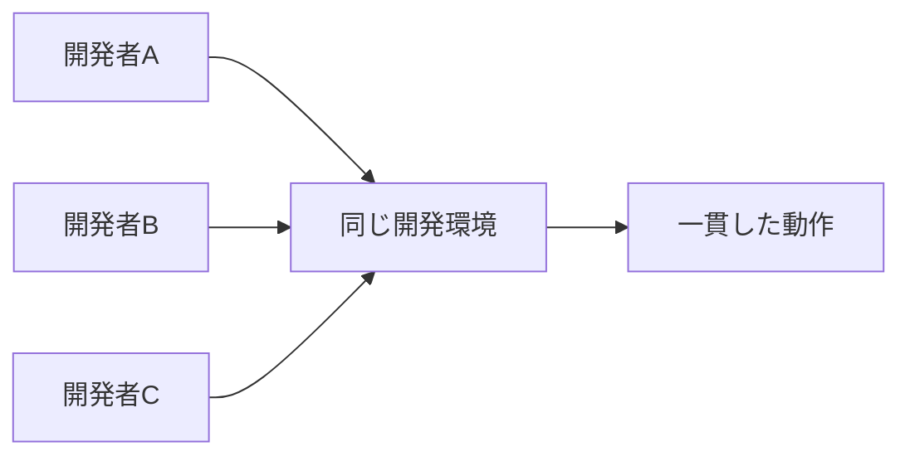

# はじめに

「新しいプロジェクトに参加したけど、開発環境の構築に丸一日かかってしまった...」
「チームメンバーそれぞれの環境で微妙に動作が違って、デバッグに時間を取られる...」

こんな経験はありませんか？

**devcontainer**は、これらの問題を解決する強力なツールです。本記事では、devcontainerの基本から応用まで、実践的な例を交えながら解説します。

# devcontainerとは？

devcontainer（Development Container）は、**開発環境全体をコンテナ化する仕組み**です。Visual Studio Code（VSCode）と統合されており、プロジェクトごとに独立した開発環境を簡単に構築・共有できます。

## 従来の開発環境の課題

1. **環境構築の複雑さ**: 言語、ツール、ライブラリのインストールと設定
2. **環境の不一致**: 「私の環境では動くのに...」問題
3. **環境の汚染**: 複数プロジェクトの依存関係が競合
4. **オンボーディングの時間**: 新メンバーの環境構築に時間がかかる

## devcontainerが解決すること



- **再現性**: 誰でも同じ環境を瞬時に構築
- **ポータビリティ**: どのマシンでも同じ環境
- **隔離性**: プロジェクトごとに独立した環境
- **バージョン管理**: 環境設定もGitで管理

# 基本的な使い方

## 必要なもの

1. **Docker Desktop**（またはDocker Engine）
2. **Visual Studio Code**
3. **Dev Containers拡張機能**

```bash
# Dockerのインストール確認
docker --version

# VSCodeの拡張機能をコマンドラインからインストール
code --install-extension ms-vscode-remote.remote-containers
```

## 最小構成のdevcontainer

プロジェクトのルートに `.devcontainer` ディレクトリを作成し、`devcontainer.json` を配置します。

```json
{
  "name": "My Project",
  "image": "mcr.microsoft.com/devcontainers/base:ubuntu",
  "features": {
    "ghcr.io/devcontainers/features/git:1": {}
  }
}
```

これだけで、Ubuntuベースの開発環境が立ち上がります！

# 実践的な設定例

## Node.js開発環境

```json
{
  "name": "Node.js Project",
  "image": "mcr.microsoft.com/devcontainers/javascript-node:18",
  "features": {
    "ghcr.io/devcontainers/features/node:1": {
      "version": "18",
      "nodeGypDependencies": true
    }
  },
  "customizations": {
    "vscode": {
      "extensions": [
        "dbaeumer.vscode-eslint",
        "esbenp.prettier-vscode",
        "streetsidesoftware.code-spell-checker"
      ],
      "settings": {
        "editor.formatOnSave": true,
        "editor.defaultFormatter": "esbenp.prettier-vscode"
      }
    }
  },
  "forwardPorts": [3000],
  "postCreateCommand": "npm install",
  "remoteUser": "node"
}
```

## Python機械学習環境

```json
{
  "name": "Python ML Project",
  "build": {
    "dockerfile": "Dockerfile",
    "context": ".."
  },
  "features": {
    "ghcr.io/devcontainers/features/python:1": {
      "version": "3.11"
    },
    "ghcr.io/devcontainers/features/jupyterlab:1": {}
  },
  "customizations": {
    "vscode": {
      "extensions": [
        "ms-python.python",
        "ms-python.vscode-pylance",
        "ms-toolsai.jupyter"
      ]
    }
  },
  "postCreateCommand": "pip install -r requirements.txt",
  "mounts": [
    "source=${localEnv:HOME}/.ssh,target=/home/vscode/.ssh,type=bind,consistency=cached"
  ]
}
```

対応するDockerfile:

```dockerfile
FROM mcr.microsoft.com/devcontainers/python:3.11

# GPUサポート（オプション）
RUN apt-get update && apt-get install -y \
    libgl1-mesa-glx \
    libglib2.0-0 \
    && rm -rf /var/lib/apt/lists/*

# 追加のPythonパッケージ
COPY requirements.txt /tmp/
RUN pip install --upgrade pip && \
    pip install -r /tmp/requirements.txt
```

# 高度な機能

## 1. Docker Composeとの連携

複数のサービスを組み合わせた開発環境を構築できます。

`.devcontainer/docker-compose.yml`:

```yaml
version: '3.8'

services:
  app:
    build:
      context: ..
      dockerfile: .devcontainer/Dockerfile
    volumes:
      - ..:/workspace:cached
    command: sleep infinity
    environment:
      - DATABASE_URL=postgresql://user:pass@db:5432/myapp
    depends_on:
      - db
      - redis

  db:
    image: postgres:15
    environment:
      POSTGRES_USER: user
      POSTGRES_PASSWORD: pass
      POSTGRES_DB: myapp
    volumes:
      - postgres-data:/var/lib/postgresql/data

  redis:
    image: redis:7-alpine

volumes:
  postgres-data:
```

`.devcontainer/devcontainer.json`:

```json
{
  "name": "Full Stack App",
  "dockerComposeFile": "docker-compose.yml",
  "service": "app",
  "workspaceFolder": "/workspace",
  "features": {
    "ghcr.io/devcontainers/features/docker-in-docker:2": {}
  },
  "forwardPorts": [3000, 5432, 6379],
  "postCreateCommand": "npm install && npm run db:migrate"
}
```

## 2. 開発環境のライフサイクルフック

```json
{
  "initializeCommand": "echo '開発環境を初期化中...'",
  "onCreateCommand": "bash .devcontainer/setup.sh",
  "updateContentCommand": "npm install",
  "postCreateCommand": "npm run prepare",
  "postStartCommand": "git config --global user.email 'dev@example.com'",
  "postAttachCommand": "echo 'VSCodeにアタッチされました！'"
}
```

各コマンドの実行タイミング:

- **initializeCommand**: コンテナ作成前（ホスト側で実行）
- **onCreateCommand**: コンテナ作成時（一度だけ）
- **updateContentCommand**: コンテナ作成時とリビルド時
- **postCreateCommand**: updateContentCommandの後
- **postStartCommand**: コンテナ起動時
- **postAttachCommand**: VSCodeがアタッチされた時

## 3. 環境変数とシークレット

```json
{
  "containerEnv": {
    "NODE_ENV": "development",
    "API_ENDPOINT": "http://localhost:3000"
  },
  "remoteEnv": {
    "PATH": "${containerEnv:PATH}:/opt/custom/bin"
  },
  "secrets": {
    "AWS_ACCESS_KEY_ID": {
      "description": "AWS Access Key"
    },
    "AWS_SECRET_ACCESS_KEY": {
      "description": "AWS Secret Key"
    }
  }
}
```

## 4. GPUサポート

```json
{
  "runArgs": ["--gpus", "all"],
  "containerEnv": {
    "NVIDIA_VISIBLE_DEVICES": "all",
    "NVIDIA_DRIVER_CAPABILITIES": "compute,utility"
  }
}
```

# ベストプラクティス

## 1. イメージの選択

```json
{
  // ❌ 避けるべき: 汎用的すぎる
  "image": "ubuntu:latest",
  
  // ✅ 推奨: 開発用に最適化されたイメージ
  "image": "mcr.microsoft.com/devcontainers/base:ubuntu",
  
  // ✅ より良い: 言語特化型イメージ
  "image": "mcr.microsoft.com/devcontainers/python:3.11"
}
```

## 2. 拡張機能の管理

```json
{
  "customizations": {
    "vscode": {
      "extensions": [
        // 必須の拡張機能
        "ms-python.python",
        "ms-python.vscode-pylance"
      ]
    }
  },
  // 推奨拡張機能（ユーザーが選択可能）
  "recommendations": [
    "github.copilot",
    "eamodio.gitlens"
  ]
}
```

## 3. パフォーマンスの最適化

```json
{
  "mounts": [
    // node_modulesをボリュームマウント（高速化）
    "source=node_modules,target=/workspace/node_modules,type=volume"
  ],
  "postCreateCommand": "npm install",
  // ビルドキャッシュの活用
  "build": {
    "dockerfile": "Dockerfile",
    "args": {
      "BUILDKIT_INLINE_CACHE": "1"
    }
  }
}
```

## 4. セキュリティ

```json
{
  // root以外のユーザーで実行
  "remoteUser": "vscode",
  
  // 必要最小限の権限
  "runArgs": [
    "--cap-drop=ALL",
    "--cap-add=SYS_PTRACE"
  ],
  
  // 読み取り専用ファイルシステム（必要な箇所のみ書き込み可能）
  "mounts": [
    "source=/tmp,target=/tmp,type=tmpfs"
  ]
}
```

# トラブルシューティング

## よくある問題と解決方法

### 1. コンテナが起動しない

```bash
# ログを確認
docker logs <container_id>

# 手動でコンテナに入って確認
docker exec -it <container_id> /bin/bash
```

### 2. 拡張機能が動作しない

```json
{
  "customizations": {
    "vscode": {
      "extensions": [
        // バージョンを指定
        "ms-python.python@2023.20.0"
      ]
    }
  }
}
```

### 3. パフォーマンスが遅い

```json
{
  // macOSでの最適化
  "mounts": [
    "source=${localWorkspaceFolder},target=/workspace,type=bind,consistency=delegated"
  ],
  // 大きなディレクトリを除外
  "postCreateCommand": "echo 'node_modules' >> .dockerignore"
}
```

# 実践例：マルチ言語プロジェクト

フロントエンド（React）とバックエンド（Python）を含むプロジェクトの例:

```json
{
  "name": "Full Stack Project",
  "build": {
    "dockerfile": "Dockerfile",
    "args": {
      "NODE_VERSION": "18",
      "PYTHON_VERSION": "3.11"
    }
  },
  "features": {
    "ghcr.io/devcontainers/features/node:1": {},
    "ghcr.io/devcontainers/features/python:1": {}
  },
  "customizations": {
    "vscode": {
      "extensions": [
        "dbaeumer.vscode-eslint",
        "ms-python.python",
        "ms-python.vscode-pylance",
        "esbenp.prettier-vscode"
      ],
      "settings": {
        "python.defaultInterpreterPath": "/usr/local/bin/python",
        "python.linting.enabled": true,
        "python.linting.pylintEnabled": true,
        "editor.formatOnSave": true,
        "[javascript]": {
          "editor.defaultFormatter": "esbenp.prettier-vscode"
        },
        "[python]": {
          "editor.defaultFormatter": "ms-python.python"
        }
      }
    }
  },
  "forwardPorts": [3000, 8000],
  "postCreateCommand": "npm install && pip install -r requirements.txt"
}
```

# 上級者向けTips

## 1. カスタムFeatureの作成

独自のFeatureを作成して、チーム内で共有できます。

```json
{
  "features": {
    "./local-features/my-feature": {}
  }
}
```

## 2. CI/CDとの統合

```yaml
# GitHub Actions例
name: Test in devcontainer

on: [push]

jobs:
  test:
    runs-on: ubuntu-latest
    steps:
      - uses: actions/checkout@v3
      - uses: devcontainers/ci@v0.3
        with:
          runCmd: npm test
```

## 3. プリビルドイメージ

```yaml
# .github/workflows/build-devcontainer.yml
name: Build devcontainer

on:
  push:
    paths:
      - '.devcontainer/**'

jobs:
  build:
    runs-on: ubuntu-latest
    steps:
      - uses: actions/checkout@v3
      - name: Build and push
        uses: devcontainers/ci@v0.3
        with:
          imageName: ghcr.io/${{ github.repository }}/devcontainer
          push: always
```

# まとめ

devcontainerは、開発環境の標準化と共有を劇的に簡単にする強力なツールです。

**初心者の方へ**: まずは基本的な設定から始めて、徐々に機能を追加していきましょう。

**上級者の方へ**: Docker Compose連携、カスタムFeature、CI/CD統合など、より高度な機能を活用することで、チーム全体の生産性を向上させることができます。

## 次のステップ

1. 既存プロジェクトにdevcontainerを追加してみる
2. チームメンバーと環境を共有する
3. CI/CDパイプラインに組み込む
4. カスタムFeatureを作成して再利用性を高める

開発環境の構築に悩む時間を減らし、本来のコーディングに集中できる環境を手に入れましょう！

## 参考リンク

- [Dev Containers公式ドキュメント](https://containers.dev/)
- [VSCode Dev Containers](https://code.visualstudio.com/docs/devcontainers/containers)
- [利用可能なFeatures一覧](https://github.com/devcontainers/features)

Happy Coding with devcontainers! 🚀
